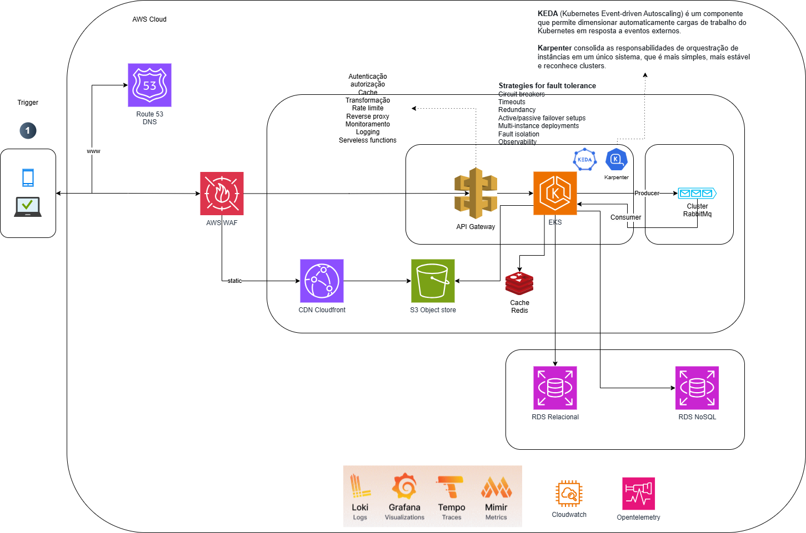

# Desafio Fluxo de Caixa

Desenvolvimento de microserviço FluxoCaixa.

## Diagrama de solução:

 <br><br>


## Documento de arquitetura:

[Documento de arquitetura](dsa-fluxocaixa.pdf)<br><br>

## Recursos

- Informar depósito e saque de valor;
- Apresentar extrato;

## Requisitos obrigatórios

- Docker / Docker compose


## Arquitetura / designer 

- API REST
- CQRS - Segregação de Responsabilidade de Comando e Consulta
- Clean architecture
- Fail fast validations - Falhe o mais rápido possível
- Padrão de projeto Mediator com Behaviours
- Exception - Middleware filters


## Tecnologias

- .net 9
- Gerenciador de pacotes nuget
- MySql 
- Mongodb
- RabbitMQ
- ELK / Kibana
- MassTransit;
- Migration
- Docker
- docker compose


## Instalação

### Docker

Para rodar o projeto via Docker compose, executar o comando:

```
$ docker compose -f docker-compose.yml -f docker-compose.override.yml up -d --build
```

Aguarde baixar as dependências e carregar todo o projeto;<br>

Aguarde carregar todo o serviço web. <br>
Caso queira ter captura de log pelo ELK, tirar os comentários do docker-compose.yml e do docker-compose.override.yml. Está comentado pois consome muita memória. 
Após concluído, acesse o swagger pelo seu navegador. <br>


## Swagger 

Documentação da API REST (em desenvolvimento): <br>

http://localhost:5001/swagger


Endpoints:

- Para obter o token jwt:

```
curl --location 'https://localhost:5001/api/v1/autorizar' \
--header 'Content-Type: application/json' \
--data '{
  "nome": "Luiz"
}'
```


Incluir a resposta do token obtido acima no header das requisições abaixo:<br>
Authorization: Bearer {token}
- Depositar valor:

```
curl --location 'http://localhost:5001/api/v1/fluxocaixa/depositar' \
--header 'Content-Type: application/json' \
--header 'Authorization: Bearer {token}' \
--data '{
  "valorTransacao": 120
}'
```
- Sacar valor:
```
curl --location 'http://localhost:5001/api/v1/fluxocaixa/sacar' \
--header 'Content-Type: application/json' \
--header 'Authorization: Bearer {token}' \
--data '{
  "valorTransacao": 120
}'
```
- Extrato diário:
```
curl --location 'http://localhost:5001/api/v1/fluxocaixa/extrato?Data=2023-10-18' \
--header 'Authorization: Bearer {token}
```

Para encerrar tudo digite:

```
$  docker compose -f docker-compose.yml -f docker-compose.override.yml down
```

OBS: É necessário ter o Docker e docker-compose instalado.
Caso não tenha instalado o Docker ou dê alguma falha na instalação, tente com os comandos abaixo.


## Testes

Para realizar os testes unitários, execute o seguinte comando no terminal:

```
$ cd Services/FluxoCaixa/Testes/Teste.FluxoCaixa
$ dotnet test
```


## Débitos técnicos:
- Dados sensíveis no docker compose/appsettings;
- Padronização de response para api;
- Configurar interface de healthcheck para os endpoints configurados; 


## Licença

Projeto licenciado sob <a href="LICENSE">The MIT License (MIT)</a>.<br><br>

Desenvolvido por<br>
Luiz Moreira<br>
luiz.f.queiroz@gmail.com<br>
https://www.linkedin.com/in/luizfqm/<br>
https://github.com/luizMoreira<br>
